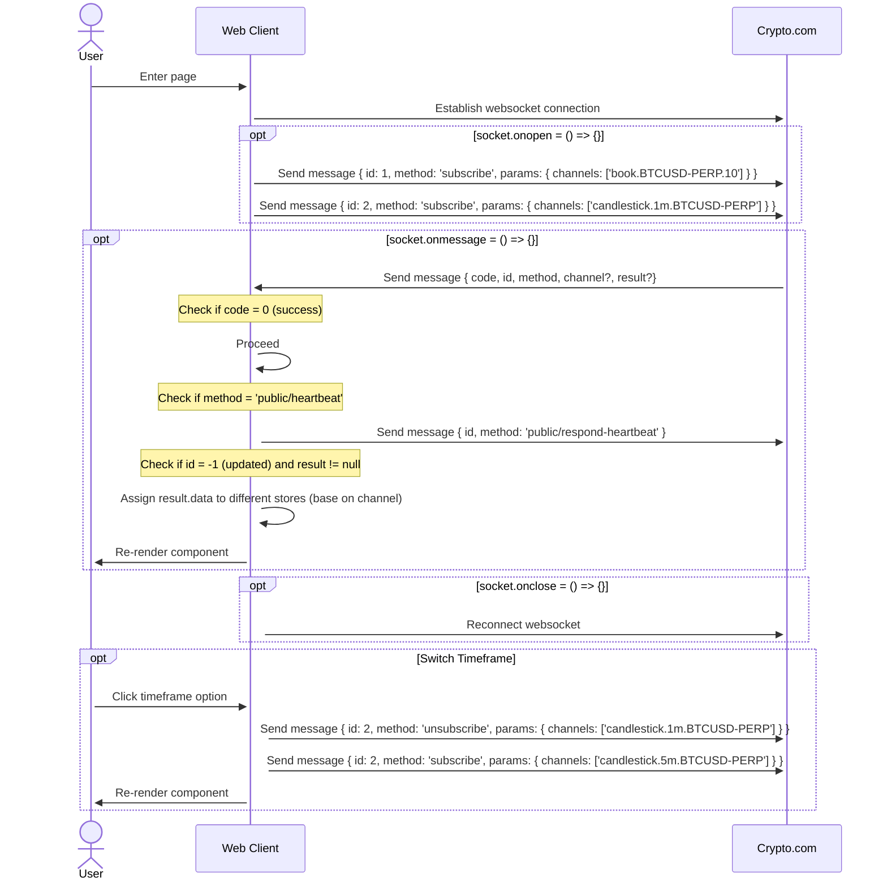

# cryptoExchange

### https://yuanwu0000.github.io/cryptoExchange/

Implement real-time order book and candlestick charts like a crypto exchange (integrate crypto.com API by using websocket.)

[](https://www.youtube.com/watch?v=Z-fJEUXQLNs)

See Crypto.com API doc [here](https://exchange-docs.crypto.com/exchange/v1/rest-ws/index.html#book-instrument_name).

## Tech Stack

Frontend Framework: **vue 3**<br>
CSS Framework: **scss**<br>
UI Library: **lightweight charts**<br>
State Management: **pinia**<br>
Build Tool: **vite**<br>

## Project Structure

```
├── src
|    │ App.vue
|    │ main.js
|    │
|    ├─assets
|    │   logo.svg
|    │   main.css
|    │
|    ├─components
|    │   Candles.vue
|    │   OrderBook.vue
|    │
|    ├─stores
|    │   candles.js
|    │   orderBook.js
|    │   ws.js
```

## Websocket Flow Chart



## Project Setup

```sh
yarn
```

### Compile and Hot-Reload for Development

```sh
yarn dev
```

### Lint with [ESLint](https://eslint.org/)

```sh
yarn lint
```

### Compile and Minify for Production

```sh
yarn build
```

### Serve dist

```sh
npm install -g serve
```

```sh
serve -s dist
```
