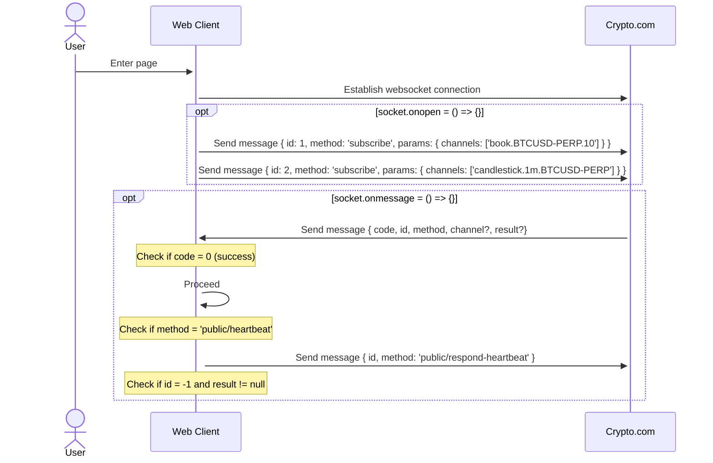

# cryptoExchange

Implement real-time order book and candlestick charts like a crypto exchange (integrate crypto.com API by using websocket.)

[](https://www.youtube.com/watch?v=Z-fJEUXQLNs)

See Crypto.com API doc [here](https://exchange-docs.crypto.com/exchange/v1/rest-ws/index.html#book-instrument_name).

## Websocket Flow



## Project Setup

```sh
yarn
```

### Compile and Hot-Reload for Development

```sh
yarn dev
```

### Lint with [ESLint](https://eslint.org/)

```sh
yarn lint
```

### Compile and Minify for Production

```sh
yarn build
```

### Serve dist

```sh
npm install -g serve
```

```sh
serve -s dist
```
